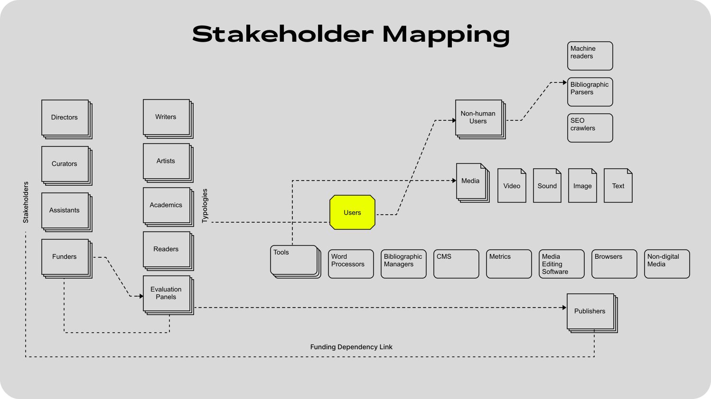

CLIENTS: [Nottingham Contemporary](https://www.nottinghamcontemporary.org/), [Made Abroad](https://madeabroad.io/)  | ROLE: UX Researcher | TOOLS: Adobe CC, Bibliographic Managers, Figma, HTML (Open Metadata)

<!--more-->

## Context

[The Contemporary Journal](https://thecontemporaryjournal.org) is Nottingham Contemporary's digital-first open-access publication platform on contemporary art and culture. Nottingham Contemporary is a contemporary art centre at the historic Lace Market quarter of the city of Nottingham, UK.

Nottingham Contemporary was looking to establish a digital publication platform that could showcase original content for the Art Centre’s multiple digital audiences, while catering for the needs of the academic stakeholders who funded the project.

For this project, I worked with design studio Made Abroad and senior staff at Nottingham Contemporary.

## Research Activities

My role as UX researcher required understanding how to impactfully integrate the heterogeneous user base of Notingham Contemporary's new digital platform, while meeting the business needs of the stakeholders. I advocated for the platform's users, while taking into account the needs of the funders, who sought academic impact for all the published material. 

For the Discovery and Explore phases, I:

- Held (unstructured) stakeholder Interviews to establish our user knowledge base.
- Employed a microethnographic methodology to map and understand how users interact with their digital publication tools. This methodology (also known as an ‘ethnographic microanalysis of interaction’), consists of observing the existing tools and artefacts that users interact with—paying close attention to the agency of these tools.

This stakeholder mapping phase revealed interdependencies that needed to be addressed:

For the Test phase, I:

- Increased our understanding of users' technical tools and by observing and testing user tools.
- Investigated and mapped the technical journeys of users.
- Collaborated with designers to produce a usability test, revealing a complex workflow that needed to become accessible and easier to use.
- Delivered insights that led to the metadata design of the site. These insights increased the discoverability of the journal's publications and complied with quantifiable open standards.
- Delivered a Usability Report with definitions and suggestions for the editorial workflow of the journal.

## Requirements Delivery

Overall, my research developed a framework of compatibility for open-access publishing that met the funder's (Academia) requirements, while mapping insights for the UX workflow that aided the developers and designers. The following insights shaped the design and editorial process:

- The new platform needed to implement [DOI or Digital Object Identifiers](https://www.doi.org/) for each published item. DOIs are standard, unique, and persistent metadata references (handles) to a published digital resource (i.e. an article, a research dataset, or a keynote presentation). Equipping each published item makes it discoverable, traceable, and allows for a measurable impact of dissemination.
- The new platform needed to implement [ORCIDs](https://orcid.org/), the equivalent metadata reference for individual authors. By implementing this requirement as part of the editorial workflow, users would be nudged to have a profile, meeting the funder's need to have rich evidence of impact for research assessment exercises.

