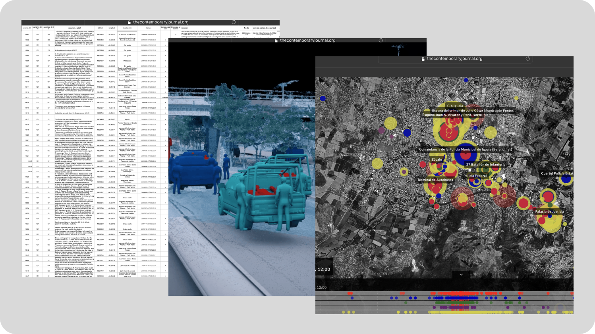

CLIENT: [Forensic Architecture](https://forensic-architecture.org/) | ROLE: Pattern Analyst | SERVICES: Data-mining, Translation | TOOLS: Spreadsheet databases

<!--more-->

## Context

[Forensic Architecture](https://forensic-architecture.org/methodology/pattern-analysis) is a London-Based research agency that employs spatial research to investigate human rights violations committed by states, police forces, militaries, and corporations. [Plataforma Ayotzinapa](http://www.plataforma-ayotzinapa.org/) is an investigative journalism platform and an interactive cartographic project for the analysis of a high-profile case of human rights violations in Mexico, where 43 students were forcibly disappeared in 2014.

Forensic Architecture was commissioned with the design of a digital platform to visualise data gathered by the Inter-American Commission on Human Rights. The platform responded to an urgency: the pursuit of justice and human rights. However, all key forensic information was scattered in dense legal reports that made a detailed analysis difficult.

For this project, I worked with Forensic Architecture's multi-disciplinary team.

## Research Activities

As Pattern Analyst for this project, I:

- Structured and synthesised research from 1000+ pages of raw juridical reports—collaborating with a team of pattern analysts, researchers, designers, developers, architects, and stakeholders to turn this research into 5000+ data points for the digital platform.
- Refined databases by transforming bilingual data into actionable, machine-readable and positioning-centric data points.
- Supported the live testing of the platform by collaboratively editing the dataset in real-time (Prototype life cycle phase).
- Ensured data operations adhered to security standards, protecting vulnerable people mentioned in the reports.